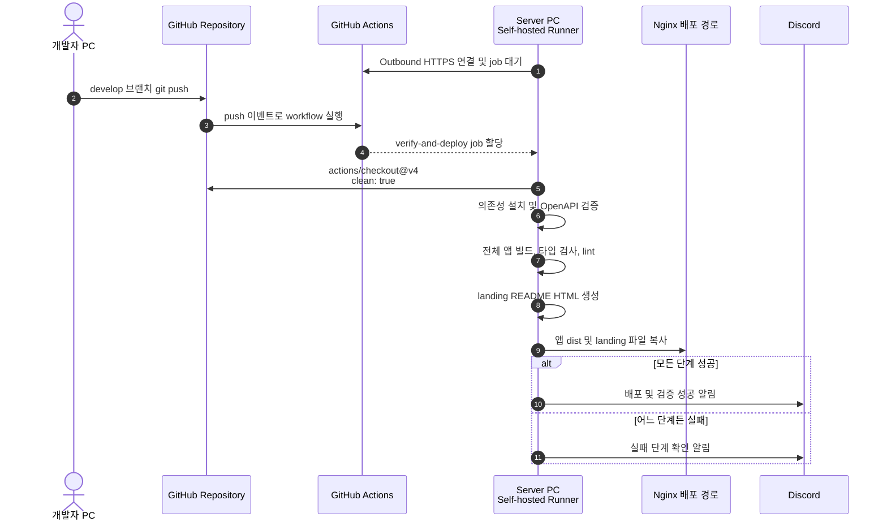
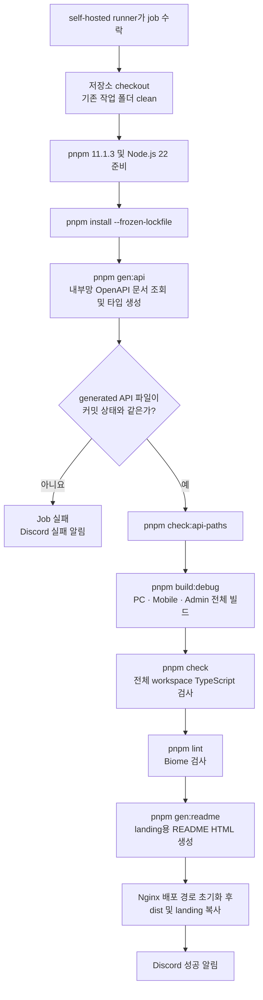

# CI/CD 실행 흐름

이 문서는 현재 저장소의 [GitHub Actions 워크플로](../.github/workflows/ci.yml), [루트 스크립트](../package.json), [Turborepo 설정](../turbo.json)을 기준으로 실제 CI/CD 흐름을 정리합니다.

## 현재 구조 요약

현재 파이프라인은 `develop` 브랜치 push 한 번으로 검증, 전체 앱 빌드, 서버 배포까지 수행하는 단일 job 구조입니다.

| 항목 | 현재 설정 |
| :--- | :--- |
| 트리거 | `develop` 브랜치 `push` |
| Workflow | `Develop Branch CI/CD` |
| Job | `verify-and-deploy` |
| Runner | 서버 PC에 설치된 `self-hosted` runner |
| 동시 실행 | `develop-ci-cd` 그룹에서 최신 실행만 유지 |
| 런타임 | Node.js `22`, pnpm `11.1.3` |
| 빌드 API URL | `/channel/backend/api/v1` |
| 배포 방식 | runner가 Nginx 서빙 경로를 비운 뒤 산출물을 직접 복사 |
| 결과 알림 | `DISCORD_WH` secret을 사용하는 Discord webhook |

## Git push부터 서버 배포까지

서버 PC는 GitHub의 인바운드 접속을 기다리는 배포 API 서버가 아닙니다. 서버 PC에서 실행 중인 self-hosted runner가 GitHub Actions에 outbound 연결을 맺고 대기하다가 할당된 job을 받아 실행합니다. 따라서 네트워크 관점의 시작 방향은 `Server PC → GitHub Actions`입니다.

> 참고: [GitHub Docs — Self-hosted runners communication](https://docs.github.com/en/actions/reference/runners/self-hosted-runners#communication)

## Job 내부 실행 순서

위 다이어그램에서 별도 분기로 표시하지 않은 명령도 종료 코드가 0이 아니면 이후 단계가 중단되고 실패 알림 단계로 이동합니다.

## 단계별 분석

### 1. push 및 실행 제어

- `develop` 브랜치에 push할 때만 실행됩니다. PR 생성이나 다른 브랜치 push에는 실행되지 않습니다.
- concurrency group은 `develop-ci-cd`이며 `cancel-in-progress: true`입니다.
- 짧은 시간에 여러 번 push하면 이전 실행을 취소하고 최신 실행을 진행해 같은 배포 폴더를 동시에 수정하지 않도록 합니다.

### 2. 서버 PC의 job 수신

- GitHub Actions는 `runs-on: self-hosted` 조건에 맞는 runner에 job을 할당합니다.
- runner 프로세스가 중지되어 있거나 GitHub에 연결할 수 없으면 job은 실행되지 않고 대기합니다.
- checkout의 `clean: true`로 재사용되는 runner 작업 디렉터리의 이전 빌드 잔재를 정리합니다.

### 3. 의존성 및 API 계약 검증

1. `pnpm install --frozen-lockfile`로 lockfile과 동일한 의존성을 설치합니다.
2. `pnpm gen:api`가 auth, product, system 서비스의 OpenAPI 문서를 조회해 generated 타입을 다시 만듭니다.
3. `git diff`와 `git status`로 generated API 파일이 커밋된 상태와 같은지 확인합니다.
4. `pnpm check:api-paths`로 FE API 호출 경로가 generated OpenAPI 경로에 존재하는지 확인합니다.

이 구간은 서버 PC에서 내부 OpenAPI URL에 접근할 수 있어야 동작합니다. OpenAPI가 변경됐지만 generated 파일이 커밋되지 않은 경우에도 의도적으로 실패합니다.

### 4. 빌드 및 정적 검증

- `VITE_API_URL=/channel/backend/api/v1`을 주입하고 `pnpm build:debug`를 실행합니다.
- Turborepo가 `pc-web`, `mobile-web`, `admin-portal`을 모두 빌드합니다.
- 각 앱은 배포 시 `/pc/`, `/mobile/`, `/admin/` base path를 사용합니다.
- 빌드 후 `pnpm check`로 TypeScript를 검사하고 `pnpm lint`로 Biome lint를 실행합니다.
- 현재 workflow에는 단위 테스트나 Playwright E2E 실행 단계가 없습니다.

### 5. landing 생성 및 Nginx 배포

- `pnpm gen:readme`로 `README.md`를 `landing/assets/fe.readme.html`로 변환합니다.
- runner가 각 대상 디렉터리를 비운 뒤 새 파일을 직접 복사합니다.

| 대상 | 원본 | 배포 경로 |
| :--- | :--- | :--- |
| PC Web | `apps/pc-web/dist/*` | `/Users/channelunit/apps/bx-cf-fe/pc-web` |
| Mobile Web | `apps/mobile-web/dist/*` | `/Users/channelunit/apps/bx-cf-fe/mobile-web` |
| Admin Portal | `apps/admin-portal/dist/*` | `/Users/channelunit/apps/bx-cf-fe/admin-portal` |
| Landing | `landing/*` | `/Users/channelunit/apps/bx-cf-fe/landing` |

워크플로만 보면 runner가 접근할 수 있는 로컬 파일시스템 또는 마운트 경로에 배포합니다. 별도 SSH, rsync, 배포 API 호출 단계는 없습니다.

### 6. 결과 알림

- 모든 단계가 성공하면 저장소, 커밋 메시지, 실행자를 포함한 성공 알림을 보냅니다.
- 어느 단계든 실패하면 GitHub Actions 실행 화면에서 실패 단계를 확인하도록 Discord 알림을 보냅니다.
- 알림 전송에는 runner의 `jq`, `curl` 명령과 GitHub Actions secret `DISCORD_WH`가 필요합니다.

## 현재 범위와 주의점

1. **테스트는 현재 CI에 포함되지 않습니다.** 빌드, TypeScript, lint, OpenAPI 정합성은 검사하지만 단위 테스트와 E2E는 실행하지 않습니다.
2. **세 앱과 landing이 항상 함께 배포됩니다.** 변경된 앱만 선별하는 `paths` 조건이나 affected build/deploy 단계가 없습니다.
3. **배포는 원자적 교체가 아닙니다.** 대상 폴더를 먼저 비우고 파일을 복사하므로 복사 실패나 실행 취소 시 일시적으로 빈 디렉터리 또는 일부 파일만 남을 수 있습니다.
4. **진행 중 실행은 새 push로 취소될 수 있습니다.** 배포 중 취소되는 경우 다음 실행이 정상 완료될 때까지 서비스 파일이 불완전할 가능성이 있습니다.
5. **현재 배포 산출물은 debug build입니다.** `build:debug`는 source map을 만들고 minify를 끄므로 운영 배포 정책에 맞는지 별도 확인이 필요합니다.
6. **산출물 디렉터리가 없으면 해당 앱 복사를 건너뜁니다.** 배포 스크립트의 `if [ -d ... ]` 조건 때문에 누락 자체가 배포 단계 실패로 처리되지는 않습니다.
7. **OpenAPI 검증은 내부망 가용성에 의존합니다.** Swagger 서버 장애나 네트워크 단절도 CI 실패 원인이 됩니다.

## 현재 흐름의 성격

현재 구성은 별도의 CI 서버와 배포 서버를 분리한 구조가 아니라, self-hosted runner가 설치된 서버 PC 한 곳에서 검증·빌드·Nginx 파일 배포를 연속 수행하는 **단일 runner 직접 배포 방식**입니다.
